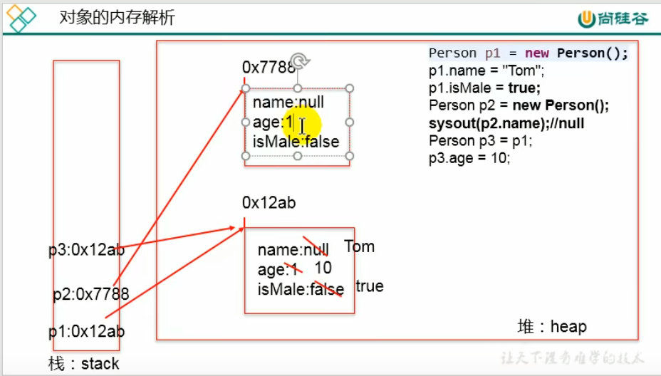

# 一. 完整分区

**常用的栈(stack)指的是虚拟机栈**：

1. 当堆中的内容没有栈中的变量指向引用时候，会在有限时间内被垃圾回收（CG）
2. 当方法开始执行时，按照声明的先后顺序入栈
3. 当方法执行完毕后，**栈中的局部变量按照后进先出原则出栈**
4. 当变量出栈后，堆中的内容可能又会没有栈中变量指向，可能会被回收

# 二、内存分析

## 1.数组分析

**new 代表在堆空间中开辟空间**

## 2. 对象分析

## 3. 静态变量内存分析

## 4. 线程内存

+ **方法区和堆属于进程，多个线程是共享的**

+ **程序计数器和栈是每个线程的独立的，各有一套**

# 三、JVM结构

## 1. 堆结构（Heap)

主要分为三个部分：

+ `Young`新生区（**新生代**）
+ `Old`养老区
+ `Perm`永久区（即**方法区**，也被称为**永久代**）

其中`String`常量池存储在方法区的元空间

