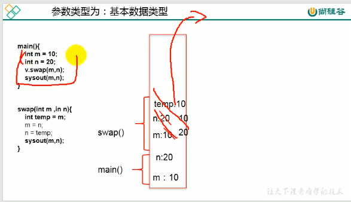
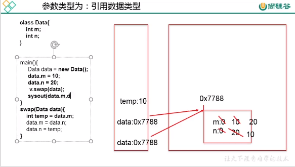
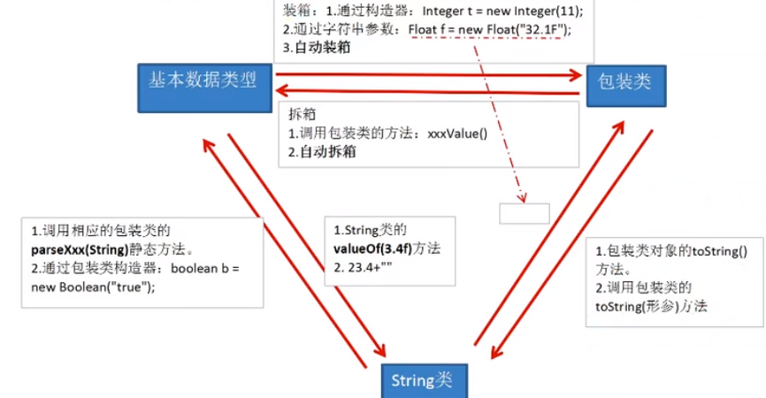

# 一、基本特征

**对象是类的派生，接口是类的抽象。**

同一类对象的集合叫做类

## 1. 类的结构

1. 属性
2. 方法
3. 构造器
4. 代码块（可选)
5. 内部类（可选）

## 2.三大特征

1. 封装性
2. 继承性
3. 多态性
4. 抽象性

## 3.主要关键字

| 关键字    | 描述 | 用法 |
| --------- | ---- | ---- |
| return      | 返回 | 返回结果或结束方法 |
| this      | 当前 | 表示当前这个对象或方法 |
| super     | 超级 | 表示当前类父类的构造器或方法 |
| static    | 静态 | 修饰同一类对象共有的结构 |
| final     | 最终 | 修饰某一个不可改变的结构 |
| class     | 类 | 用于类的定义 |
| extend     | 继承 | 用于类继承或接口继承接口 |
| instanceof    | 实例是 | 判断a是否是B的实例 |
| abstrract | 抽象 | 声明抽象类或抽象方法 |
| interface | 接口 | 声明接口 |
| implement     | 实现 | 类去实现接口 |
| package   | 包 | 指定当前类的包 |
| import    | 导入 | 导入指定包到当前类 |


## 4.权限修饰符

| 修饰符    | 中文     | 作用域                 |
| --------- | -------- | ---------------------- |
| public    | 公有     | 全部                   |
| protected | 受保护的 | 当前类和其子类或同一包 |
|           | 缺省     | 同一个包下             |
| private   | 私有     | 仅当前类               |

+ **权限可以修饰类和类的内部结构（属性、构造器、方法、内部类）**

+ **修饰类只能用public或缺省**


## 5.内存分析

每一次new就是在堆空间开辟一块地址创建一个对象，每一个声明就是在栈顶压入一个变量（指向堆空间的地址或null），**使用声明变量=null，仅仅只是让栈中的变量不指向，堆中的对象依然存在**


# 二、类和对象

+ **类（class）是对同一类相似事物的统一描述**

+ **对象（object）是某一个类的实际个体，因此也被称为实例（instance）**

万事万物皆对象，将功能和结构封装到类中，通过实例化来调用具体的功能结构


## 1. 类的成员

**设计类实际上是设计类的成员**

### 1.1 属性（field）

属性对应类中的基本信息，是类的成员变量（域、字段）

#### 1.1.1 成员变量和局部变量

| 项目       | 成员变量 | 局部变量              |
| ---------- | -------- | --------------------- |
| 定义       | 类的属性 | **代码块当中的变量*** |
| 存储位置   | 堆空间** | 虚拟机栈空间          |
| 权限修饰符 | 是       | 否                    |
| 是否初始化 | 是       | 否，必须显示赋值***   |

**`*`成员变量可以在方法内、方法行参数、构造器内、构造器、代码块内)**

**`**`static声明的成员变量存储在方法区**

**`***`形式参数在调用时赋值**

属性和变量遵循就近原则，同一个类中不同范围的属性、变量可以同名

#### 1.1.2 属性赋值先后顺序

属性赋值方式和先后顺序如下：

1. **默认初始化**（0或null)
2. 静态代码块
3. **显示初始化**（直接在定义属性时候赋值）或**非静态代码块**
4. **构造器初始化**（在构造器中赋值）
5. 通过"对象.方法"或"对象.属性"赋值

非静态代码块和显示赋值顺序取决于他们的先后顺序，**谁在前谁先生效**

**调用顺序**

1. **静态代码块**（父先于子，若main在子类中静态代码块先于main）
2. **调用代码块**
3. **代码块之后是构造器**


### 1.2 方法（method）

方法对应类可以进行的行为，对应于C类中的函数

+ **非void的必须有返回值，void方法return表示方法结束**
+ 形参列表：方法的形式参数
+ 方法中可以调用类的属性和方法

#### 1.2.N1 可变形参（JDK5）

在JDK5.0后加入，使用`...`可以自动接收可变长度形参，等同于之前的数组形参，**但只可以是形参列表中的最后一个参数** ，若有重载同类型确定参数，传入确定参数时，优先考虑确定参数的重载。


#### 1.2.1 方法重载（overload）

**在同一个类中同名方法，但形参列表的个数或形式不同**

类名、方法名和参数列表唯一确定一个方法


#### 1.2.3 行参和实参

形参：方法的接收参数

实参：实际传给方法的参数



形参是实参的副本，因此基本数据类型是直接赋值，故内部方法不会改变外部实参的值，**因此可以使用引用数据类型来操作**




### 1.3 构造器（construct）

构造器是和类名同名的一个构造器块，用来生成构建一个当前类的对象，构造器可以在*创建对象时给对象属性进行初始化或执行初始方法*。

+ **创建对象实际上是 new 构造器**
+ 未定义构造器默认有一个无参构造器
+ 一旦显示定义构造器，**不会再默认生成无参构造器**
+ 一个类中，至少有一个构造器
+ 构造器也可以使用权限修饰符进行封装隐藏


### 1.4 代码块（codeBlock)

代码块也称为初始化块，由一对`{}`直接括起来，并在其中编写方法体，**代码块只能使用`static`修饰**，因此也被分为**静态代码块**和**非静态代码块**

+ **静态**代码块在**类加载时就而执行**，全局**只执行一次**，只可调用静态
+ **非静态**代码块在**创建对象时执行**，创建时**都会执行**，可以调用全部

如果一个类中有**多个代码块**，**静**态代码块先于非静态执行，**同一类**型**按照先后顺序执行**。


### 1.5 内部类（innerClass)

一个类在另一个类的类别，当前类被称为内部类，包含其的类被称为外部类，有**成员内部类**和**局部内部类**

+ 成员内部类，直接在类的`{}`中声明，根据是否有`static`修饰分为**静态内部类**和**非静态内部类**
  + 作为外部内的成员，**可以使用四种权限修饰符修饰**
  + 静态内部类实例化`外部类.内部类 x=new 外部类.内部类()`
  + **非静态内部类实例化`外部类.内部类 x=外部类实例.new 内部类()`**
  + 在非静态内部类调用外部类方法，**实际上是省略了`外部类名.this.方法()`**
+ 局部内部类，声明在方法体或代码块中，通常用于构建类或实现接口返回，通常使用**匿名内部类的方式**


## 2. 类的实例化

类的实例化，就是创建类的对象

```java
Person lpc=new Person();
```

**其中`Person`为类，`lpc`为Person类的一个对象（实例），Person是一系列和lpc相似对象的统一描述**


## 3. 类和对象的使用

1. 创建类，设计类成员
2. 创建类的对象
3. 通过"对象.属性"或"对象.方法"的方式去调用对象的结构
4. 通过对象反推出类的成员设计（反射）


## 4. 匿名对象

**创建对象后，没有显示赋予变量名，即匿名对象**：

+ 只能使用一次
+ 同时用于参数传递（实际上成为了方法的形式参数入栈）


# 三、功能特性

## 1. 封装性

解决可见性问题，**将功能使用权限修饰符进行封装**，仅暴露对外提供使用的方法和属性，避免部分不愿暴露的属性被更改后导致对象异常，将方法编程黑盒操作，只提供输入和输出，便于对小部分模块的维护。


## 2. 继承性

类之间可以进行继承，来获取被继承类的属性和方法，减少代码冗余，提高复用，同时可以便于功能扩展。其结构为：

+ 子类：也称派生类，subclass
+ 父类：也称为超类、基类、superclass

继承可以获取父类的：全部属性、方法，**其中无论是否私有构造后堆空间会存在**，只是无法在子类中直接调用

### 2.1 继承形式

Java单继承：**一个类可以有多个子类，一个类只能由一个父类**，子类与父类是相对概念，之类可以是其他类的父类，父类也可以是其他类的子类。

直接继承的类叫直接父类，间接继承的叫做间接父类，**之类会获取直接父类和所有间接父类的全部属性和方法**

如果没有显示声明父类，那么会默认继承`Object`类，**所有类都直接或间接继承于`Object`**

**子类的同名属性不会覆盖父类的属性**，在堆空间中是两个不同的内存空间，但默认会优先使用子类属性，**可以使用关键字`super`来调用父类的同名属性**

### 2.2 方法重写（override/overwite）

**子类使用于父类同名、同参的方法对父类中已经存在方法进行覆盖**，调用时，实际执行的是子类重写的方法。重写后方法调用的是子类中的（从父类继承的方法中调用原父类中的方法被子类重写后，实际上调用的是重写方法）**重载是编译时的行为，因此也被称为静态绑定**

#### 2.2.1 重写限定规则

+ 子类中的重写方法的权限可见性**不能低于父类中的权限可见性**。

+ 子类**不能重写父类中的private方法**
+ 子类重写方法的返**回类型必须是被重写方法返回类型或其子类**，若为基本数据类型必须是相同基本数据类型（基本数据类型不是类，没有子类）。
+ 之类重写方法的抛**出异常类型不能大于父类方法抛出异常类型**
+ 只有非`static`方法可以重写（static使用类名调用，不叫重写）

### 2.3 子类构造器

若在子类构造器没有使用this(形参)或super(形参)，**子类构造器首行会默认调用super()**，且可省略不写。

**若父类没有空参构造器，必须在首行显示的调用super(形参)构造器**（若显示调用后就不会默认调用不存在的空参，否则空参不存在导致检查错误）。

### 2.4 子类实例化

+ 子类实例化后会获取所有父类中全部声明的属性和方法
+ 子类实例化会先从父类的构造器开始，父类又会优先调用其父类的，因此**子类实例化会最先调用Object的空参构造器**（子类构造器首行默认调用`super()`）
+ 虽然调用了父类的构造器，但在堆空间中只创建了一个对象，父类结构都在这个对象空间中。


## 3. 多态性

+ 一个对象的多种形态，**子类对象可以表现为父类的形态**，即父类的引用可以指向子类的对象。

+ 当使用父类的引用调用方法，若该方法被子类重写，**父类的引用会调用子类重写的方法，此时为虚拟方法调用**

+ **编译时检测左边的引用，运行时执行右边的构造**
+ **对象的多态性只适用于方法，对属性不生效**（因为属性不支持重写，同名属性都存在于堆空间，根据就近原则，用什么类掉，优先调用当前引用的属性，**使用子类构造父类，调用的同名属性是父类的属性**）

**仅当存在继承关系，并调用子类重写方法时，才属于多态性**

### 3.1 虚拟方法调用

**多态性是一个运行时行为**。父类调用被子类重写的方法时，此时父类的方法被称为`虚拟方法`，在**运行时根据父类指向堆空间中的对象确定到底调用的哪个方法**，因此此时方法是在运行时被绑定到父类方法中的，因此也被称为`动态绑定`。

### 3.2 向下转型

因为多态性在堆空间中构造的实际是子类对象，存在子类的全部方法和属性，因为声明是父类对象因此编译时只能使用父类方法，因此可以**使用向下转型（强转类型转换）转换为子类引用**，在**编译时可以调用子类特有方法。**

**向下转型依然是运行时行为**，编译器无法检测是否可以强转，只有当运行时绑定时才会执行，否则会抛出ClassCastException异常，可以使用`instanceof`进行判断。

**向下转型可以转为会构造时对象的当前类或其父类**。


## 4. 抽象性（多态扩展）

抽象性由抽象类和接口来体现，因其都不能进行实例化，实际上是子类去使用，由子类作为父类去使用**体现了面向对象的多态性**，同时继承实现当中对方法的实现实际上类似于对方法的重写也**体现了继承性**。

### 4.1 抽象类

用`abstract`修饰的类是抽象类，其也可以用来修饰方法

+ 抽象声明的类**不可实例化，没有具体的实例**，只是作为定义具体结构的父类，但仍然有构造器供子类实例化调用（**所有类都有构造器**）

+ 抽象声明的类只有方法的声明**没有方法体**，仅供子类复写。为避免抽象方法直接被调用，因此具**有抽象方法的类一定是抽象类**。
+ 继承抽象类，必须重新所有抽象方法或继续声明为抽象类。
+ **`abstract`不能修饰私有方法、静态方法**

### 4.2 接口

`interface`用来定义接口，类和接口是并列关系，处于同一级别，**其中接口可以被多实现**，接口中的结构全部是public，可以定义的有：

+ 全局常量，可以省略`public static final`
+ 抽象方法，可以省略`public abstract`
+ 静态方法（JDK8）
+ 默认方法（JDK8)

**抽象类是类的抽象，接口是动作的抽象**，**接口不能实例化**，接口相当于一种规范，类似于"如果需要....必须有...."

#### 4.2.1 实现接口

类可以使用`implement`来实现一个或多个接口，但需要实现所有接口的中所有抽象方法，否则必须声明为抽象类。

+ 类可以同时继承父类并实现接口

```java
public final Integer extend Number implement AddAble{
    // TODO
}
```

+ 接口可以继承接口，继承后将同时包含父接口的抽象方法和属性

```java
public Addable extend NumberAble{
    // TODO 
}
```

#### 4.2.2 JDK8接口

JDK8中多了**静态方法**和**默认方法**，其都可以声明方法体

+ 静态方法和类的静态方法一致，只能使用`接口名.方法`调用，**使用`static`修饰**
+ 默认方法和抽象方法类似，但是不必强制实现，由接口提供默认的方法体，实现类可以对**默认方法进行复写**，**使用`default`修饰**
+ 若同时实现**多个接口都有同名同参**默认方法，**必须重新默认方法**
+ 若继承的**父类中的方法和实现的接口中默认方法由同名同参**，若未重写，**优先调用父类的方法（类优先）**
+ 若重写方法后需要调用接口中的默认方法，**可以使用`接口.super.方法`调用**


### 4.3 匿名类

直接使用抽象类或接口名声明，并在之后使用`{}`并在其中实现其中的抽象方法，此时该类是抽象类/接口的子类/实现类，但没有类名，因此被称为匿名类


# 四、关键字

## 1. return

`return`在方法体中，用于结束方法，若该方法是有返回值的方法，会将返回值返回。**其后不可以声明执行语句**。


## 2. this

`this`在用来修饰方法、属性或构造器。

用来指明当前对象或方法，在形参和属性不同名的情况下可以省略。**在类中定义方法时，使用属性或内部方法实际上是省略了this**

构造器中使用this可以调用之前定义的构造器，**且必须在首行**


## 3. super

`super`用于在之类中调用父类的构造器或方法，当子类重写了父类的方法时，需要使用父类被复写方法时，可以**使用super来调用父类原未被重写的方法**

**当子父类出现同名属性时，使用super可以调用到父类的属性**

使用super(形参列表)来调用父类中的构造器，且必须在首行，因此this和super构造器只能二选一。


## 4. instanceof

`a instanof B` 判断a是否是B的实例，如果是返回true，否则返回false。


## 5. import 

`import`用于在类中显示的导入指定包下的类、接口。

位置在`package`和`class`之间，可以导入多个结构，使用`X.*`可以导入X包下全部结构，**但不能导入子包**，`java.lang`包下或**当前类同包下**的类可以省略，默认自动导入

当出现不同包下的同名类使用时，后使用的需要**使用全类名（包.类名)的方式进行使用**，实际上import的作用是在不同名的情况下省略了全类名中的包名

`import static X`**静态导入**，可以直接在类中使用X类中的静态结构，如果使用`X.*`同样是导入该类中的全部静态结构


## 6. static

`static`用来修饰属性、方法、代码块和内部类，表示同一类的全部派生对象都共有的属性或方法。**静态结构和生命周期和类一致（类加载到关闭），非静态结构生命周期和对象一致（实例化到回收）。**

### 6.1 静态变量

+ 用static修饰的属性被称为**静态变量/类变量**，**同一类的多个对象共享静态变量**。非静态变量被称为实例变量不同对象都各有一套。
+ **静态变量加载早于对象的创建**，在类加载时加载，因此也可以通过`类.属性`方式进行调用
+ 因为类只加载一次，因此**静态变量在内存中只有一份**（方法区的静态域static Field）。

### 6.2 静态方法

+ 静态方法定义和使用同上，**静态方法中只能调用静态方法和属性**，非静态方法中即可以调用非静态也可以调用静态方法和属性
+ 在静态方法内不能使用this和super，静态方法中调用的静态方法/属性默认省略的类名，实际上是`类名.属性`或`类名.方法`

### 7. final

`final`可以修饰类、方法、变量（包括属性）；

+ 用来修饰一个类，此**类不能再被继承**，例如`String系列`
+ 修饰方法后，该**方法不能再被重写**，例如`Object#getClass()`
+ 修饰变量后，该变量成为常量，**不能再改变**
  + **修饰属性**，不能使用默认初始化可以**显示初始化**，**代码块中赋值**或**构造器赋值**
  + 修饰局部变量或形参声明为`final`，不能再改变，只能调用。
+ `static final`用来修饰属性，即成为全局常量，也可以用来修饰方法，但意义不大。


# 五、特殊类和对象

## 1. JavaBean

javaBean是一个标准Java类，定义如下：

+ 类是public的
+ 有一个无参public构造器
+ 有属性，且有对应的get/set方法；

**主要用于数据封装和数据交互**


## 2. Object类

若没有显示使用`extend`继承于某个类，会自动继承于`Object`类，其是一切类的根类，其只有一个空参构造器和通用方法。

### 2.1 finalize

`finalize()`**方法在当前对象即将被垃圾回收器释放时自动调用（回收前）**，此方法中的方法体会在垃圾回收前执行

`System.gc()`可以通知垃圾回收器进行回收（但不是立即执行）

### 2.2 equals和==

`equals`比较两个对象是否相等，**默认Object中的定义为`==`**

`==`对基本数据类型是比较值（char会转换为数值），对引用类型来说`==`比较地址值（包括string）

String、Date、File和包装类都重写了equals方法，因此是内容的比较，特别的String如果是显示赋之前存在过的值会直接在常量池获取，使用==地址也相等。

### 2.3 getClass

获取当前类的类对象，**不可重写**

### 2.4 hashCode

获取当前类的Hash码，若不重写默认生成一个随机值，其中`String`进行过重写，默认会使其值相同返回的相同。

通常在出现多个属性且包含基本数据类型时，使用`String`*31,可以减少重复项目（**31=2^5-1 且是质数**，不可约重复率更低）


## 3. 包装类

包装类和基本数据类型一一对应，用来以对象形式来保存基本数据类型。

| 基本数据类型 | 包装类     |
| ------------ | ---------- |
| byte         | Byte       |
| short        | Short      |
| int          | Integer    |
| long         | Long       |
| folat        | Folat      |
| double       | Double     |
| boolean      | Boolean    |
| char         | Characcter |

**其中Byte到Double数值类型包装类都有共同父类Number**


### 3.N1 自动装拆箱(JDK5)

JDK5.0后，包装类和基本数据类型可以自动转换

### 3.1 相互转换



+ 转换为String，使用**`String.valueOf(X)`**
+ 转换为包装类或基本数据类型，使用包装类`X.parseXxx(Str)`
+ **其中，Boolean转换时只要不是true都是false**

### 3.2 特殊

`Integer`内调用了IntegerCache缓存了-128——127的数据，如果是自动装箱方式在此范围内会直接使用其中元素使用完后不会销毁，因此若在此范围内，相同数字的包装类其地址是相同的。


