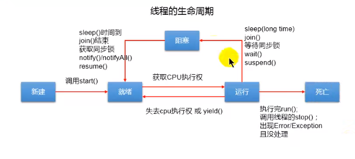

# 一、线程

+ 程序（program）：一系列指令的集合，即**一段静态代码**
+ 进程（process)：正在运行的程序，是**一个动态过程**
+ 线程（thread)：进程的进一步细分，是**程序内部的一条执行路径**，同一个进程在同一时间**并行**执行多个线程，即多线程


## 1. JAVA线程

### 1.1 默认线程

**一个JAVA用于程序，至少有3个线程**：

+ main()主线程
+ gc()垃圾回收线程
+ 异常处理线程

### 1.2 多线程内存

**线程是JAVA调度和执行的最小单位**，每个线程都有独立的运行栈和程序计数器（PC），一个JAVA应用若有多个线程，可以共享进程的内存空间，

+ **方法区和堆属于进程，多个线程是共享的**
+ **程序计数器和栈是每个线程的独立的，各有一套**


### 1.3 JAVA线程状态

在`Thread`中有一个内部枚举类`State`记录线程的生命周期状态：

| State         | 中文     | 含义                 |
| ------------- | -------- | -------------------- |
| NEW           | 新建     | 刚刚实例化并，未运行 |
| RUNNABLE      | 运行     | 已经执行起来         |
| BLOCKED       | 阻塞     | 阻塞                 |
| WAITING       | 等待     | 阻塞，不带参数wait() |
| TIMED_WAITING | 定时等待 | 定时阻塞             |
| TERMINATED    | 已终止   | 执行结束             |

### 1.4 线程生命周期



按照CPU分配时间和运行分为如下**生命周期状态**：

+ 新建：新建**一个Thread对象**
+ 就绪：执行`start()`方法，但还**未获得CPU分配的执行权**，等待执行
+ 运行：线程获得CPU分配的时间片开始执行代码
+ 阻塞：人为将其挂起，不接收CPU分配，相关方法有：
  + `sleep(long t)`：等待t毫秒后结束
  + `A.join`：执行join的线程阻塞**等待A线程执行完毕**
  + `wait()`：等待`notify()`或`notifyAll()`唤醒
  + `suspend()`：挂起，等待`resume()`**（已过时）**
  + **等待同步锁获取**
+ 死亡：`run()`方法**执行完毕**、调用`stop()`或**出现未处理异常错误**


## 2. 并行并发

并行： 多个CPU同时执行多个线程

并发：单个CPU使用**时间片轮转**"同时"执行多个线程


# 二、创建多线程

线程的执行都和`Thread`类相关，根据JDK文档声明有两种创建线程的方式

## 1. Thread子类

规范的Thread子类创建线程包含4步：

1. 创建Thread子类
2. 重写`run()`方法
3. 创建Thread子类的实例
4. 调用实例`start()`方法

```java
public class SubThread {
    public static void main(String[] args) {
        // 3. 创建子类实例
        ThreadRun threadRun = new ThreadRun();
        // 4. 调用start方法
        threadRun.start();
    }
}

// 1. 创建Thread的子类
class ThreadRun extends Thread{
    // 2. 重写run 方法
    @Override
    public void run() {
        for(int i=0;i<100;i++){
            if(i%2==0)
                System.out.println(i);
        }
    }
}
```

**若只使用一次，可以使用匿名内部类的方式**


## 2. 实现Runnable接口

使用`Runnable`接口完成线程，依然又规范的步骤，同时启动时依然使用`Thread`类

1. 创建类实现Runable接口
2. 实现类需要实现`run()`抽象方法
3. 构造实现类的实例
4. 使用该实例作为Thread的形参构造`Thread`对象
5. 调用Thread对象的`start`方法

```java
public class RunnableThread {
    public static void main(String[] args) {
        // 3. 构造 实现类对象
        RunThread runThread=new RunThread();
        // 4. 使用实现类构造Thread 对象
        Thread thread=new Thread(runThread);
        // 5. 调用Thread start方法
        thread.start();
    }
}

// 1. 实现 Runnable
class RunThread implements Runnable{
    // 2. 实现 run 方法
    @Override
    public void run() {
        for(int i=0;i<100;i++){
            System.out.println(i);
        }
    }
}
```


## 3. 实现Callable接口（JDK5）

### 3.1 Callable

与`Runnable`接口相比，`Callable`接口有如下功能：

+ 实现的`call()`方法相比`run`方法可以**有返回值**
+ 可以**抛出异常**
+ 支持**泛型返回值**
+ 但是需要**借助`FutureTask`类获取返回值**

### 3.2 Future

`Future`接口可以对实现`Runnable`或`Callable`的线程**取消执行**、**状态查询**以及**获取结果**，其默认有**唯一实现类`FutureTask`**

`FutureTask`实现了`Future`和`Runnable`接口，既可以**作为`Runnable`线程执行**也可以**作为`Future`获取`Callable`的结果**


### 3.3 创建步骤

1. **实现`Callable`接口，并重写`call()`方法**
2. 实例化`Callable`实现类对象
3. **使用`Callable`实例**作为参数**构造`FutureTask`实例**
4. **使用`FutureTask`实例**作为参数**构造`Thread`实例**（此次`FutureTask`表现为`Runnable`实现类）
5. 调用`Thread`实例对象的`start()`方法启动线程
6. 调用`FutureTask`实例对象的**`get`方法获取结果回调**（此次`FutureTask`表现为`Future`实现类)

```java
public class CallableTest {
    public static void main(String[] args) {
        // 3. 实例化 Callable 实现类 对象
        NumberPrint numberPrint=new NumberPrint();
        // 4. 使用 callable对象 作为形参构造 FutureTask 实例
        FutureTask future = new FutureTask(numberPrint);
        // 5. 使用 FutureTask 实例作为Runnable 实例 构造Thread对象 并执行
        new Thread(future).start();
        try {
            // 6. 获取回调 即 形参 Callable实现类对象的 call方法结果
            Object o = future.get();
            System.out.println("和为"+o);
        } catch (InterruptedException e) {
            e.printStackTrace();
        } catch (ExecutionException e) {
            e.printStackTrace();
        }
    }
}
// 1. 实现 Callable接口
class NumberPrint implements Callable{
    // 2. 重写 call 方法
    @Override
    public Object call() throws Exception {
        int sum=0;
        for(int i=0;i<=100;i++){
            if(i%2==0){
                sum+=i;
                System.out.println(i);
            }
        }
        return sum;
    }
}
```


## 4. 线程池

线程池统一提前批量创建线程，供需要使用时使用，待使用完毕后回收供之后使用。

### 4.1 ExecutorService

`ExecutorService`是执行服务接口，常用子类`ThreadPoolExecutor`线程池，主要有如下方法：

+ `execute(Runnable r)`: 没有返回值的普通执行；
+ `<T> Future<T> submit(Callable<T> task)`：执行任务并有返回值
+ `shutdown()` ：关闭线程池

### 4.2 Executors

`Executors`是线程池工具/工厂类，封装了线程池构造方法和常用方法：

+ `newCachedThreadPool()`: 创建一个可以扩展的线程池
+ `newFixedThreadPool(n)`: 创建一个**可重复使用固定数量的线程池**
+ `newSingleThreadExecutor()`: 创建只包含一个线程的线程池
+ `newScheduledThreadPool(n)`: 创建一个可延时或定期执行的线程池


## 4.3 创建步骤

1. 使用`Executors`获取一个线程池（实际上是`ThreadPoolExecutor`)
2. 强转后可以配置线程池相关属性
   1. `setCorePoolSize(n)`： 设置核心线程数
   2. `setKeepAliveTime(n,u)` : 设置空闲线程保持空闲的等待时间 (超过该时间将被终止) ，参数是**数量和单位**
   3. `setMaximumPoolSize(n)`：设置最大线程数
3. **调用`execute(Runnable r)`或`submit(Callable c)`执行任务**
4. 使用结束后调用`shutdown()`方法销毁线程池

```java
public class ExecutorPoolTest {
    public static void main(String[] args) {
        // 1. 使用 Executor 获取 线程池 (实际上是ThreadPoolExecutor)
        ExecutorService executorService = Executors.newFixedThreadPool(10);
        // 1.2 强转为实现类设置线程池的属性
        ThreadPoolExecutor poolExecutor= (ThreadPoolExecutor) executorService;
        poolExecutor.setCorePoolSize(5); // 设置核心线程大小
        // 设置空闲线程保持空闲的等待时间 (超过该时间将被终止)  参数是 数量和单位
        poolExecutor.setKeepAliveTime(1000,TimeUnit.DAYS);
        poolExecutor.setMaximumPoolSize(10);// 设置最大线程数
        
        // 2. 无返回执行
        executorService.execute(new ThreadRun());
        // 3. 有返回执行
        Future submit = executorService.submit(new NumberPrint());
        try {
            System.out.println(submit.get());
        } catch (InterruptedException e) {
            e.printStackTrace();
        } catch (ExecutionException e) {
            e.printStackTrace();
        }
        // 4. 关闭线程池
        executorService.shutdown();
    }
}
```


# 三、线程方法

## 1. Thread常用方法

| 方法            | 特殊 | 描述                                     |
| --------------- | ---- | ---------------------------------------- |
| start()         |      | 启动当前线程                             |
| run()           |      | 线程启动后执行的方法，**通常需要去重写** |
| currentThread() | 静态 | 获取**执行当前代码的线程对象**           |
| getName()       |      | 获取当前线程名称                         |
| setName()       |      | 设置当前线程名称                         |
| yield()         |      | 释放当前时间片（**可能马上又抢到**）     |
| join()          |      | 让该线程**独占CPU直到执行完成**          |
| stop()          | 过时 | 强制结束线程                             |
| sleep(long t)   | 静态 | **调用的线程阻塞**t**毫秒**时间          |
| isAlive()       |      | 判断该线程**是否还在运行**（存活）       |
| getPriority()   |      | 获取当前线程的优先级                     |
| setPriority()   |      | 设置当前线程的优先级                     |


## 2. 线程优先级

使用`setPriority()`可以设置线程的优先级，默认又三档：

`MAX_PRIORITY`、`MIN_PRIORITY`和`NORM_PRIORITY`，分别对应10、1、5，优先级越高被CPU分配的时间块**概率越高**不一定始终在低优先级前。


## 3. sleep与wait区别

+ `sleep()`在`Thread`中定义，`wait()`在`Object`中定义
+ `sleep()`可以在任意地方调用，**`wait()`只能由同步监视器调用**
+ **`sleep()`不会释放同步锁**，**`wait()`会释放同步锁**


# 四、线程安全

当一个线程在操作某一个共享数据时，**其他线程无法参与，直到其操作完毕**才可以被其他线程操作，即使其**被阻塞也必须等待**执行完毕。

## T1. synchronized和同步监视器

**`synchronized`关键字用来声明需要同步锁定的代码块或方法**

**同步监视器**即**锁**指的是`synchronized(A)`其中的A，可以是任意对象，用来判断是否归该线程所有，要求**多个线程必须共用一把锁**。


## T2. 死锁

若一个操作有多个同步监视器，并且多个线程相互拿着对方的需要的另外的锁，导致程序无法继续执行。


## 1. 同步代码块

使用`synchronized(Obj lock){// 方法体}`把需要同步或共享的资源操作放到`{}`中，根据同步锁（同步监视器）来判断锁定，在**共享操作时串行执行**。

```java
class Windows implements Runnable {
    int ticket = 50;

    @Override
    public void run() {
        while (true) {
            synchronized (this) {
                if (ticket > 0) {
                    try {
                        Thread.sleep(100);
                    } catch (InterruptedException e) {
                        e.printStackTrace();
                    }
                    System.out.println(Thread.currentThread().getName() + "卖出 : " + ticket--);
                }
            }
        }
    }
}
```

+ 通常锁在实现`Runnable`接口时**使用`this`当前对象作为同步锁**

+ 继承`Thread`时**使用`类.class`当前类对象作为同步锁**

## 2. 同步方法

如果操作共享数据的代码在一个完整的方法中，可以使用`synchronized`声明方法，使其成为一个同步方法。

实际上同步方法是一种特殊的同步代码块，其**同步监视器是`this`当前对象，若用`static`修饰同步监视器为`类.Class`当前类对象**

```java
class Windows2 extends Thread {
    static int ticket = 50;

    @Override
    public void run() {
        while (true){
            update();
        }
    }

    public static synchronized void update() {
        if (ticket > 0) {
            try {
                Thread.sleep(100);
            } catch (InterruptedException e) {
                e.printStackTrace();
            }
            System.out.println(Thread.currentThread().getName() + "卖出 : " + ticket--);
        }
    }
}
```


## 3. Lock锁（JDK5.0）

`Lock`是一个接口作为锁，**通常使用其实现类`ReentrantLock()**`，实例化的时候可以给定参数`boolean`是否执行公平分配（先来先得），具体步骤为：

1. 实例化`ReentrantLock`对象
2. 共享操作开始前调用其`lock()`进行上锁
3. 共享操作结束后调用`unlock()`方法解锁

```java
class Wind implements Runnable{
    int ticket=50;
    // 1. 实例化 Lock 对象
    Lock lock=new ReentrantLock();

    @Override
    public void run() {
        while (true) {
            try {
                // 2. 共享操作前 执行lock方法
                lock.lock();
                try {
                    Thread.sleep(100);
                } catch (InterruptedException e) {
                    e.printStackTrace();
                }
                if (ticket > 0)
                    System.out.println(Thread.currentThread().getName() + "卖出 : " + ticket--);
            } finally {
                // 3. 执行结束后执行 unlock 方法
                lock.unlock();
            }
        }
    }
}
```

与`synchronized`相比`lock`**相当于手动上锁和解锁**


# 五、线程通信

使用`wait()`和`notify`或`notifyAll()`可以相互阻塞唤醒来进行线程的通信，但**必须是由同步监视器调用**

+ 当线程执行`wait()`时被阻塞**并释放锁**
+ 当线程执行`notify()`时候会唤醒被`wait()`阻塞的线程，若有**多个线程阻塞优先唤醒高优先级**线程
+ 当线程执行`notifyAll()`时候会**唤醒所有被`wait()`阻塞的线程**

**以上三个方法均定义在`Object`类中**，

## 案例1 交替输出

```java
public class Communication {
    public static void main(String[] args) {
        WindowsC windowsC=new WindowsC();
        new Thread(windowsC).start();
        new Thread(windowsC).start();
    }
}

class WindowsC implements Runnable {
    int ticket = 50;

    @Override
    public void run() {
        while (true) {
            synchronized (this) {
                if (ticket > 0) {
                    System.out.println(Thread.currentThread().getName() + "卖出 : " + ticket--);
                    // 唤醒其他
                    notify();
                    try {
                        // 阻塞自己
                        wait();
                    } catch (InterruptedException e) {
                        e.printStackTrace();
                    }
                }
            }
        }
    }
}
```

## 案例2 生产者消费者

[生产者消费者](../src/cn/hll520/java/mutithread/Sample.java)

