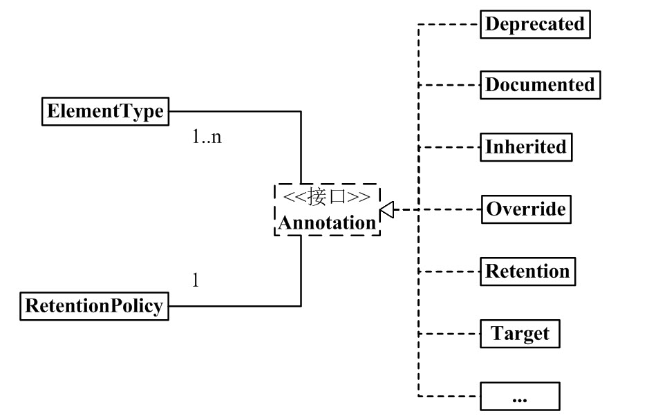

# 注解Annotation

`Annotation`注解是`JDK5`之后引入的代码**修饰器**，**类、方法、变量、参数和包等都可以被其标注**，`Annotation`可以通过`reflect`（反射）获取标注内容同时**可以被写入到字节码中**

## 1. 名词解释

| 单词              | 词性/中文          | 含义                         |
| ----------------- | ------------------ | ---------------------------- |
| Annotate          | v.注释、注解       | 无                           |
| Annotation        | n.注解、注释、评论 | 用来声明注解，其本身是注解类 |
| reflect           | v.反应、反射、思考 | 反射包                       |
| Element           | n.元素、成分       | 声明注解的作用域             |
| ElementType       | n.元素类型         | Element元注解的枚举参数      |
| Retention         | n.保留、保存       | 声明注解生命周期             |
| RetentionPolicy   | n.保留政策         | Retention元注解的枚举参数    |
| AutomicAnnotation | n.**元注解**       | 用来声明注解的注解           |


## 2. 内置注解

Java中默认定义了一套注解共有 7 个，3 个在` java.lang` 中，剩下 4 个为**元注解**在` java.lang.annotation `中，在JDK8种又额外引入的3个内置注解，**目前内置注解共10个**

### 2.1 默认注解

在`Java.lang`中定义的默认注解用于**代码检查**

| 注解                | 含义     | 描述                                                         |
| ------------------- | -------- | ------------------------------------------------------------ |
| `@Override`         | 重写     | 声明在重写或实现的**方法**上，用来告知编译器进行代码检查     |
| `@Deprecated`       | 过时     | 被其声明的**方法**，编译器会进行检查并报**编译警告**（或删除线） |
| `@SuppressWarnings` | 抑制警告 | 在**类或方法上声明**指示编译器去忽略被声明区域的警告         |

### 2.2 元注解

**元注解是用来定义注解的注解**，在`java.lang.annotation`中

| 注解          | 含义 | 描述                                                         |
| ------------- | ---- | ------------------------------------------------------------ |
| `@Retention`  | 保留 | 声明**注解**保存周期（只在**代码**中还是编入**字节码**，或在**运行时**依然存在并可以通过反射访问）**若没有 @Retention，则默认是 RetentionPolicy.CLASS** |
| `@Documented` | 文档 | 标记**注解**是否包含在用户文档中（JavaDoc默认不包含注解)     |
| `@Target`     | 目标 | 标记**注解**可以作用于那些Java成员，**若不使用该注解，则其可以用在任何地方** |
| `@Inherited`  | 继承 | 标记**注解**是具有**继承性**（被该注解**标注的成员的子类也具有该注解**） |

### 2.3 JDK8注解

| 注解                   | 含义     | 描述                                                     |
| ---------------------- | -------- | -------------------------------------------------------- |
| `@SafeVarargs`         | 安全参数 | 忽略任何使用参数为泛型变量的方法或构造函数调用产生的警告 |
| `@FunctionalInterface` | 函数接口 | 标识一个**匿名函数方法或**函数式接口                     |
| `@Repeatable`          | 重复     | 标识**注解**可以在同一个成分上**使用多次**               |


## 3. 声明注解

**所有的注解都是`Annotation`的实现类**，**使用`@interface`标注**则实现了`java.lang.annotation.Annotation`接口表明现在定义的是一个` Annotation`注解

+ **每一个`Anootation`都必须和一个`RetentionPolicy`相关联**，定义该注解的保存策略
+ **至少与一个`ElementType`关联**，定义注解作用域

注解关系如下图




### 3.1 自定义注解

+ 使用`@interface`来声明注解（默认实现`Annotation`接口）

+ 注解的成员变量以**无参数方法**的形式来声明，其**方法名就是属性名**，**类型为其返回值**，作为注解的配置参数
+ 注解的参数类型**只能是`基本数据类型`、`String`、`Class`、`enum`、`Annotation`五种类别**
+ 可以使用**`default`来初始化属性默认值**，**否则必须赋值**
+ 若属性名称为`value`，当**只使用`value`时可以省略**
+ 若注解没有属性，则其被称为**标识**，用来标记可以用来检查

```java
@Target({ElementType.TYPE,ElementType.METHOD})
@Retention(RetentionPolicy.RUNTIME)
public @interface MyComprehension {

    // 枚举类型的
    Color color() default Color.RED;

    // 默认类型,不加default是必填项目，可以省略value，若为一个可以省略{}
    String[] value();

    // 注解类型 默认用一个注解填充
    MyAnnotation annotation() default @MyAnnotation("Comprehensive");

}
```

### 3.2 ElementType作用域

`ElementType`是**元注解`Element`**的参数的**枚举类**，用来定义注解的作用域（可以在那些成员上生效）

| 对象            | 含义     | 描述                                                         |
| --------------- | -------- | ------------------------------------------------------------ |
| TYPE            | 类型     | 可以使用在**类、接口（包括注释类型）或枚举**声明**类上**     |
| FIELD           | 字段     | 可以使用在**字段**声明上（包括枚举常量）                     |
| METHOD          | 方法     | 可以使用在**方法**声明上                                     |
| PARAMETER       | 参数     | 可以使用在**形参**声明**前**                                 |
| CONSTRUCTOR     | 构造     | 可以使用在**构造器**声明上                                   |
| LOCAL_VARIABLE  | 局部变量 | 可以使用在**局部变量**声明上                                 |
| ANNOTATION_TYPE | 注解类型 | 可以使用在**注解类型**声明上                                 |
| PACKAGE         | 包       |                                                              |
| TYPE_PARAMETER  | 泛型类型 | 可以使用在**泛型类型**声明**前**                             |
| TYPE_USE        | 类型使用 | 可以使用在**泛型使用前**、**类型强转**括号**类型前**、**异常抛出异常前** |

### 3.3 RetentionPolicy生命周期

`RetentionPolicy`是**元注解`Retention`**参数的一个**枚举类**，用来定义其注解生命周期（注解将保留生效至何时）

| 对象    | 含义   | 描述                                                         |
| ------- | ------ | ------------------------------------------------------------ |
| SOURCE  | 资源   | 注解信息仅存在于**编译之前**，编译成字节码后就不在保留该注解信息 |
| CLASS   | 字节码 | 编译后注解将存储于类对应的**字节码文件中**（默认为此）       |
| RUNTIME | 运行时 | 编译后注解不仅储存于**字节码文件中**，还可以被**JVM加载读取** |


## 4. 注解的使用

在`java.lang.Class`中定义了一些有关注解的方法，用于操作被注解定义的类，可以通过**反射**的方式获取**类的类对象（C.class）**，并对其注解进行检查进行流程处理**（只有生命周期为`RUNTIME`的注解才能处理）**

| 方法                           | 含义     | 描述                         |
| ------------------------------ | -------- | ---------------------------- |
| C.isAnnotationPresent(A.class) | 是否包含 | 判断**C类是否含有指定注解A** |
| C.getAnnotation(A.Class)       | 获取注解 | 获取C类**指定A注解的对象**   |
| C.getAnnotations()             | 获取全部 | 获取C类的**全部注解**        |