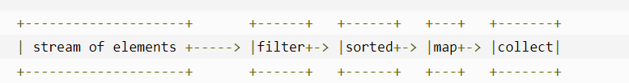

# Stream 流



流可以让一堆**元素**，向水流一样通过一个管道，达到最后的**处理端(forEach)**，中间可以对其进行**过滤（Filter）**，**排序（sorted）**和**映射（map)**等众多操作

**每一个流只能单向流动一次，一旦执行forEach或Collectors就会结束（NULL）**


## forEach 迭代

**forEach** 可以**遍历流/集合**，若是流其会**终结一个流**

案例对一个对象集合进行迭代遍历

```java
@Test
public void Foreach() {
    List<Student> students = Arrays.asList(new Student("lpc",21),new Student("ll",22),
            new Student("yy",23),new Student("love",566));
    // 遍历集合
    students.forEach(System.out::println);
    // 遍历并进行操作
    students.forEach(student -> {student.setName("myLove");});
    students.forEach(System.out::println);
}
```

结果为

```
student{name='lpc', age=21}
student{name='ll', age=22}
student{name='yy', age=23}
student{name='love', age=566}
student{name='myLove', age=21}
student{name='myLove', age=22}
student{name='myLove', age=23}
student{name='myLove', age=566}
```


## 创建流

有两种创建流的方式，只需要在集合/数组后调用对应的方法即可

+ **stream() 串行流** ：按流的顺序操作

+ **parallelStream() 并行流** ：会平行进行（非顺序）

例如对同一个集合进行操作

```java
@Test
public void 创建流(){
    List<String> strings = Arrays.asList("1", "2", "3", "a", "b", "c",  "0");
    strings.forEach(System.out::print);
    System.out.println("\n_______串行______");
    // 串行流 按顺序
    Stream<String> stream = strings.stream();
    stream.forEach(System.out::print);
    System.out.println("\n_______并行______");
    // 并行流 不会按顺序 随机执行
    Stream<String> stringStream = strings.parallelStream();
    stringStream.forEach(System.out::print);
}
```

结果为

````
123abc0
_______串行______
123abc0
_______并行______
ba0c231
````


## Filter 过滤

过滤器用于筛选流中的元素，其参数为一个传入**当前元素返回boolean的方法体**，**true会通过否则会被拦截**，其**不会终结**流可以多次过滤，有一些已经实现的过滤器：

+ **distinct() 去重**

案例对字符集合进行过滤

```
@Test
public void 过滤器() {
    List<String> strings = Arrays.asList("1", "2", "","3","a" ,"1","","a", "b", "","c", "0");
    // 过滤掉空值
    List<String> collect = strings.stream().filter(s -> !s.isEmpty()).collect(Collectors.toList());
    collect.forEach(System.out::print);
    // 过滤器不会改变原有的
    System.out.println("\n___流过后的原始值____");
    strings.forEach(System.out::print);
    System.out.println("\n___多次过滤____");
    strings.stream().filter(s->!s.isEmpty()).distinct().forEach(System.out::print);
    System.out.println("\n___全部过滤____");
    strings.stream().filter(s->false).forEach(System.out::print);
}
```

结果为

````
123a1abc0
___流过后的原始值____
123a1abc0
___多次过滤____
123abc0
___全部过滤____
````


## Map 映射

**Map** 可以将当前值经过某些操作变成一个新的值

例如将一个数组变成字符串并输出

```java
@Test
public void Map() {
    List<Integer> numbers = Arrays.asList(3, 2, 2, 3, 7, 3, 5);
    // 变成字符串
    List<String> numberStr = numbers.stream().map(i -> "数字是：" + i.toString()).distinct()
            .collect(Collectors.toList());
    numberStr.forEach(System.out::print);
    // 流操作不会改变原集合
    System.out.println("\n___流过后的原始值____");
    numbers.forEach(System.out::print);
    // 同理可以多次映射
    System.out.println("\n___多次映射____");
    numbers.stream().filter(n->n>3).map(n->n*2).map(n->"两次映射后的数字:"+n+" ").forEach(System.out::print);
}
```

其结果为

````
数字是：3数字是：2数字是：7数字是：5
___流过后的原始值____
3223735
___多次映射____
两次映射后的数字:14 两次映射后的数字:10 
````


## Limilt节选

Limit可以在流中仅通过出前N条数据，对于初始化的流必须用Limit否则会无限流出，非终结操作可以嵌套节选。

案例 输出前N个和前N个随机数

```java
@Test
public void Limit(){
    List<String> strings = Arrays.asList("1", "2", "", "3", "a", "1", "", "a", "b", "", "c", "0");
    // 筛选前5
    strings.stream().limit(5).forEach(System.out::print);
    System.out.println("\n__________________");
    // 多次筛选
    strings.stream().limit(5).limit(2).forEach(System.out::print);
    Random random=new Random();
    System.out.println("\n__________________");
    random.ints().limit(5).forEach(System.out::print);
}
```

结果为

````
123a
__________________
12
__________________
-861606105-1751899134-424860564520686102-1923997947
````


## sorted排序

Sorted()可以对流进行排序，但流中的对象必须**实现Comparable接口**，否则会报错，也可以**使用有参排序在排序时候自定义 Comparator 方法**进行排序

案例对字符串和对象进行排序

```java
@Test
public void sorted() {
    List<String> strings = Arrays.asList("1", "2", "", "3", "a", "1", "", "a", "b", "", "c", "0");
    // 默认排序
    strings.stream().sorted().forEach(System.out::print);
    System.out.println("/n_______对象排序_______");
    // 对象排序
    List<Student> students = Arrays.asList(new Student("love", 566), new Student("lpc", 21), new Student("ll", 22),
            new Student("yy", 23));
    students.stream().sorted((o1, o2) -> o1.age < o2.age ? -1 : 1)
            .forEach(System.out::println);
}
```

结果为

```
01123aabc/n_______对象排序_______
student{name='lpc', age=21}
student{name='ll', age=22}
student{name='yy', age=23}
student{name='love', age=566}
```


## Collectors 收集流

Collectors可以把流变为一个字符串或者集合，其是一个终结操作，会导致流终结。有如下方法：

+ **Collectors.joining(X,B,A)** : 转换成字符串，比用X进行分隔,在前面加上B字符串，末尾加上A字符串**（BA可以省略）**
+ **Collectors.reducing** ：进行求和统计
+ **Collectors.groupingBy(X)** : 按条件X分组输出为Map
+ **Collectors.toList/Set**： 转换成一个 List/Set 集合
+ **Collectors.toCollection** ： 转换成任意 集合
+ **Collectors.mapping(M,C)** : 先进行一次映射后再操作，相当于执行l了一次Map
+ **Collectors.collectingAndThen(C,O)** : 先处理结果为C，然后返回C->O的结果
+ **Collectors.counting** : 计数
+ **Collectors.minBy/maxBy(O)** : 对每一个对象进行O操作返回其中最大或最小的

案例

```java
@Test
public void collectors(){
    List<String> strings = Arrays.asList("11", "21", "", "333", "aa", "1024", "", "abbca", "ba", "", "cc", "0000");
    // 拼接字符串
    System.out.println(strings.stream().collect(Collectors.joining("-", "开头：", "结尾")));
    // 输出为List
    List<String> collect = strings.stream().filter(e -> !e.isEmpty()).limit(5).collect(Collectors.toList());
    System.out.println(collect);
    // 分组
    System.out.println(strings.stream().collect(Collectors.groupingBy(String::length)));
    // 长度最大值
    System.out.println(strings.stream().collect(Collectors.maxBy((o1, o2) -> o1.length() > o2.length() ? 1 : -1)));
}
```

结果为

````
开头：11-21--333-aa-1024--abbca-ba--cc-0000结尾
[11, 21, 333, aa, 1024]
{0=[, , ], 2=[11, 21, aa, ba, cc], 3=[333], 4=[1024, 0000], 5=[abbca]}
Optional[abbca]
````

### summaryStatistics()

在收集器中有一个**summaryStatistics()** 可以进行数值类型的流进行统计操作，在使用前先要用**mapToInt/Double/Long**进行一次转换

案例

```java
@Test
public void summaryStatistics(){
    List<Integer> list=Arrays.asList(1,2,30,996,886,56,520,566,9866,990125,999);
    IntSummaryStatistics stats = list.stream().mapToInt(x -> x).summaryStatistics();
    System.out.println("列表中最大的数 : " + stats.getMax());
    System.out.println("列表中最小的数 : " + stats.getMin());
    System.out.println("所有数之和 : " + stats.getSum());
    System.out.println("平均数 : " + stats.getAverage());
    List<String> listStr=Arrays.asList("1.2","2.5","3.66","566","996","520.1314","99.125","98.066");
    System.out.println("\n-------");
    DoubleSummaryStatistics dStats = listStr.stream().mapToDouble(Double::parseDouble).summaryStatistics();
    System.out.println("列表中最大的数 : " + dStats.getMax());
    System.out.println("列表中最小的数 : " + dStats.getMin());
    System.out.println("所有数之和 : " + dStats.getSum());
    System.out.println("平均数 : " + dStats.getAverage());
    System.out.println(dStats.toString());
}
```

结果

````
列表中最大的数 : 990125
列表中最小的数 : 1
所有数之和 : 1004047
平均数 : 91277.0

-------
列表中最大的数 : 996.0
列表中最小的数 : 1.2
所有数之和 : 2286.6824
平均数 : 285.8353
DoubleSummaryStatistics{count=8, sum=2286.682400, min=1.200000, average=285.835300, max=996.000000}
````

