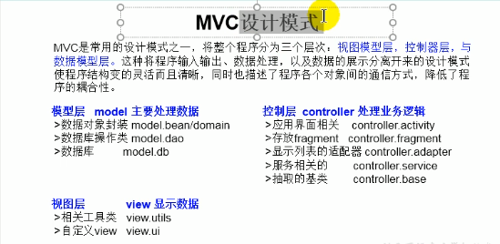
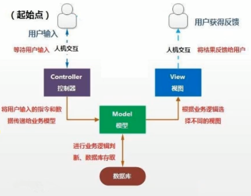

设计模式是大量经验总结出来的套路

# 一、创建模式

## 1. 单例模式Singleton

某个类在整个软件系统中始终**只有唯一一个对象**，有两种方法：

+ 懒汉式可以延迟对象创建**节省内存空间**。
+ 饿汉式从始至终只有一份**天然线程安全**。

### 1.1 饿汉式

**一开始就准备好，因此非常饥**

+ 私有化构造器
+ 内部创建对象初始化，并声明为静态
+ 通过公共静态方法获取对象

```java
public class Singleton{
    private static Singleton single=new Singleton();
    private Singleton(){}
    public static Singleton getSingleton(){
        return single;
    }
}
```

### 1.2 懒汉式

**用的时候才造，故为懒**

+ 私有化构造器
+ 声明当前类对象，不**初始化**
+ 声明静态对象并判断创建对象并返回
+ 使用`synchronized`使线程安全

```java
public class Singleton{
    private static Singleton single=null;
    private Singleton(){}
    public static synchronized Singleton getSingleton(){
        if(single==null)
            single=new Singleton();
        return single;
    }
}
```

## 2. 模板方法设计模式（TemplateMethod）

当整体流程是确定的，一部分是不确定的，可以把不确定的暴露出来作为抽象方法，整体结构都不变，用子类实现改变的抽象方法，用**不变的调用不确定的方法，保持整体流程不变。**

```java
abstract class TotalTime{
    public long todo(){
        long start=System.currentTimeMillis();
        method();
        return System.currentTimeMillis()-start;
    }

    public abstract void method();
}
```


## 3. 代理模式（Proxy）

对同一接口的使用，交给一个代理对象，让代理对象强化提升被代理对象的方法，**实际上执行的依然是被代理类的方法**，以下案例是静态代理（静态代理即每一个代理类只代理一个专门的功能或接口）

```java
public class Proxy {
    public static void main(String[] args) {
        ProxyService proxyService = new ProxyService(new Browse());
        proxyService.browse();
    }
}


// 代理类
class ProxyService implements NetWork {
    private final NetWork netWork;

    public ProxyService(NetWork netWork) {
        this.netWork = netWork;
    }

    private void check() {
        System.out.println("检测网络连接是否通顺.....");
    }

    @Override
    public void browse() {
        check();
        // 实际执行的被代理的方法
        netWork.browse();
    }
}

// 被代理类
class Browse implements NetWork {

    @Override
    public void browse() {
        System.out.println("浏览器连接网络");
    }
}

interface NetWork {
    void browse();
}
```


## 4. 工厂模式（Factory）

使创建者和调用者分离，工厂负责对象的生成，对象负责方法的调用。

### 4.1 简单工厂

```java
public class JDFactor {
    public static void main(String[] args) {
        PersonFactor.birth("student").show();
        PersonFactor.birth("teacher").show();
        Objects.requireNonNull(PersonFactor.birth("chinese")).show();
    }
}

class PersonFactor {
    public static Person birth(String type) {
        switch (type) {
            case  "student":return new student();
            case  "teacher":return new teacher();
            default:return null;
        }
    }
}

class teacher extends Person {
    @Override
    public void show() {
        System.out.println("我是老师");
    }
}

class student extends Person {

    @Override
    public void show() {
        System.out.println("我是学生");
    }
}

abstract class Person {
    public abstract void show();
}
```


# 二、结构模式


# 三、行为模式


# 四、分层模式

## 1、MVC分层设计模式





